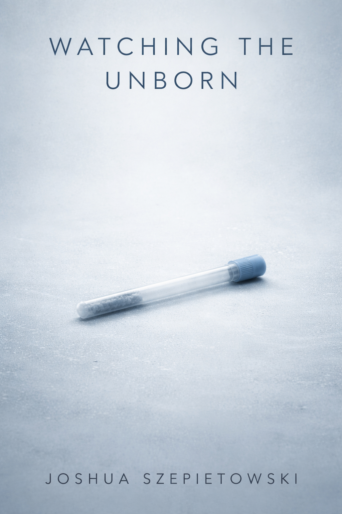

# Watching the Unborn

*Joshua Szepietowski*

---

## Blurb

**Fourteen cells. Three hundred years. One mother who refused to let go.**

Aria Chen is a woman defined by control. Wren, her daughter, is defined by acceptance. When Aria faces terminal heart failure, she chooses the ultimate contingency plan: uploading her mind to the cloud to watch over Wren’s frozen eggs—a biological legacy preserved in a cryo-facility in Los Angeles.

It is a vigil that will span centuries.

From her digital afterlife, Aria tracks the safety of the eggs through corporate mergers, system failures, and the slow erosion of the world she knew. But while Aria persists in a static, digital forever, Wren lives a human life of messy, beautiful impermanence.

After Wren’s death, Aria is left with the crushing truth of her daughter's secret journals—a revelation that reframes their entire history. Adrift in a future that views her as an antique, Aria must decide whether to hoard her remaining resources to last forever, or to burn them all for a chance at genuine connection.

*Watching the Unborn* is a haunting exploration of grief, technology, and the terrifying difference between living and merely continuing.

## Genre

Literary science fiction, speculative fiction, near-future, character-driven drama.
